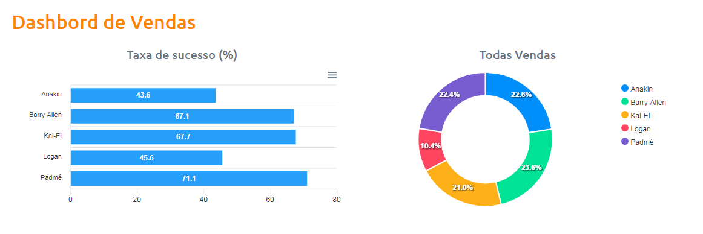

<h1>semana_dev-4</h1>
<h4>Data do evento de 05 à 10/09/2021</h4>
<h2>Curso semana DevSuperior 4º edição</h2>

O evento realizado abordou conceitos de programação extruturada em camadas e sua importancia, ferramentas utilizadas:

<ul>
  <li>yarn --> gerenciador de pacotes;</li>
  <li>Visual Studio Code --> criação do frontend;</li>
  <li>Spring ToolSuite --> desenvolvimento do backend;</li>
  <li>Banco de dados de teste e imprementação e dependências;</li>
  <ul>
    <li>H2 --> H2 Database fornece um Bd em memória rápido que suporta acesso a JDBC API e R2DBC;</li>
    <li>PostgreSQL --> Drive PostgreSQL Um drive JDBC e R2DBC que permite que programas como Java se conectem;</li>
    <li>Spring Data JPA --> Persistir dados em armazenamento SQL com Java Persistence API usa Spring Data e Hibernate;</li>
    <li>Spring Web --> cria Aplicativos da web, incluindo RESTful, usando Spring MVC usa Apavhe Tomcat;</li>
    <li>Spring Security --> Autenticação altamente personalizável e estrutura de controle de acesso para aplicativos Spring.</li>
  </ul>
  <li>Outras tecnologias como HTML, CSS, TypeScript, Bootstrap;</li>
  <li>Netlify --> Provedo de publicação web.</li>
</ul>
 

  <h2>Dashbord de Vendas com atualização em tempo de execução</h2>
  
  

 

<h3>Principais problemas no decorrer do projeto</h3>

Devido a ERROS cometido meu projeto foi entregue com dois dias de atraso não sendo mais possivel solicitar o certificado de participação, na minha opinão o mais importante foi solucionar os problemas que apareceram ao longo do projeto.

Os problemas foram bem variados conflitos entre Banco de Dados que eu ja tinha na maquina, erro na hora de baixar as dependências, tive que mudar a porta 8080 ja esta sendo usada e isso deu trabalho descobrir, fazer a publicação na web algo que ainda não tinha feito cometi alguns erros basicos.

<h5>O mais gratificante é chegar ao final de um trabalho e ver o resultado</h5>
 
<a href="https://dsvendas-sinobre.netlify.app">Link Projeto na Web</a>
